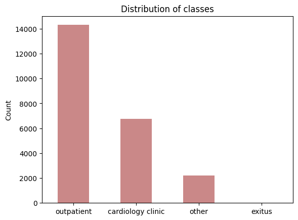
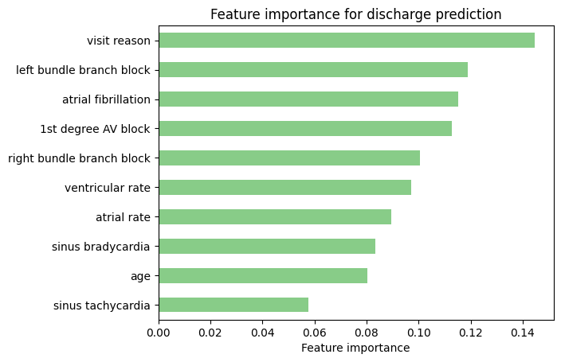
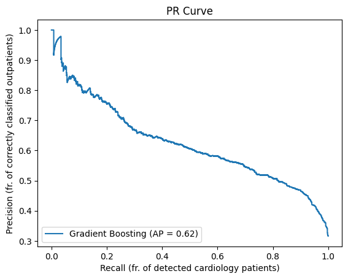
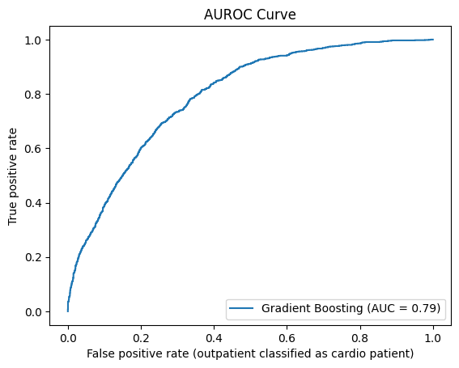

# ECG Hospitalization Prediction
This project aims to develop a system for predicting hospitalization outcomes based on electrocardiogram (ECG) data. Given ECG data from individuals in an ambulatory setting (AP) and subsequent hospitalization records, the task is to create predictive models that can automatically interpret vital sign monitor data and forecast the likelihood of hospitalization.

# Data
The data consists of ECG recordings and patient information from a large-scale study of cardiac patients in the Czech Republic. The ECG data is stored in HDF5 files, each containing a single patient’s ECG signal and metadata. The patient information is stored in a CSV file, containing demographic and clinical variables for each patient. The hospitalization records are stored in a XML file, containing the admission and discharge dates, diagnoses, and procedures for each patient.



# Methodology
The methodology consists of two main steps:

## 1. ECG feature extraction: 
This step involves parsing the ECG data and extracting various potential diagnoses using a [pre-trained deep-learning model](https://github.com/antonior92/automatic-ecg-diagnosis). First, the ECG (and additional features) are extracted from the MUSE XML file using the PatientEKGFile class from the libs folder. The model itself a 1D residual convolutional neural network that was trained on a large dataset of ECG signals and labels from the PhysioNet Computing in Cardiology Challenge 2020. The output of this step are probabilities of various ECG condition predictions for the given ECG file.

The conditions the model is able to detect are 1st degree AV block(1dAVb), right bundle branch block (RBBB), left bundle branch block (LBBB), sinus bradycardia (SB), atrial fibrillation (AF), sinus tachycardia (ST). The abnormalities are not mutually exclusive, so the probabilities do not necessarily sum to one.


## 2. Hospitalization decision: 

In the second step, we merge the condition predictions with more features that can be gathered about the patient (age, ventricular/atrial rate, visit reason) and train a gradient boosting classifier to make a final decision on whether the patient should be sent home or to a cardiology clinic. A GradientBoostingClassifier from scikit-learn is a machine learning algorithm that can be used for classification problems, such as predicting whether a patient needs to go to a cardiology clinic or not. It works by combining many simple decision trees, each of which tries to correct the errors of the previous ones, to create a more accurate and robust model. 

# Feature importance
This plot shows the relative importance of each feature used by the gradient boosting classifier to make the hospitalization decisions. The higher the value, the more influential the feature is in determining the outcome. 



# Precision-Recall curve
This plot shows how good the classifier is at finding the patients who need to go to the cardiology clinic (positive class) and avoiding the ones who can go home (negative class). Precision is the percentage of patients who are correctly sent to the cardiology clinic out of all the patients who are sent there. Recall is the percentage of patients who are correctly sent to the cardiology clinic out of all the patients who need to go there. The plot shows how these two percentages change when the classifier becomes more or less strict about its decisions. The average precision (AP) score is a number that summarizes how well the classifier does overall. The higher the AP score, the better the classifier is at determining the right discharge for patients.



# AUROC curve
This plot shows how good the classifier is at separating the patients who need to go to the cardiology clinic (positive class) from the ones who can go home (negative class). The plot shows how often the classifier is right (true positive rate) and how often it is wrong (false positive rate) when it makes different decisions. The true positive rate is the same as recall, while the false positive rate is the percentage of patients who are wrongly sent to the cardiology clinic out of all the patients who can go home. The plot also shows the area under the curve (AUROC) score, which is a number that measures how well the classifier can tell the difference between the two classes. The higher the AUROC score, the better the classifier is at separating the patients.



# Usage
First, clone the repository and install required packages:

```
git clone https://github.com/CaptainTrojan/hackhealth2023.git
cd hackhealth2023
pip install -r requirements.txt
```

Run prediction:
```
python predict.py
```

The required arguments are ECG muse file location, patient's age, and patient's visit reason
```
predict.py [-h] --ecg ECG --age AGE --visit_reason {1,2,3,4,9}

options:
  -h, --help            show this help message and exit
  --ecg ECG             Path to MUSE XML ECG
  --age AGE             Patient age
  --visit_reason {1,2,3,4,9}
                        Patient visit reason: 1: bolest na hrudi, 2: dušnost, 3: palpitace, 4: bezvědomí, 9: jiný důvod
```

Example:

```
python predict.py --ecg MUSE_20151123_100770_15000.xml --age 53 --visit_reason 2
```
